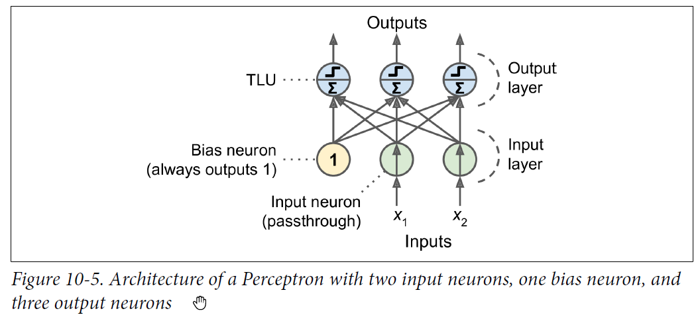
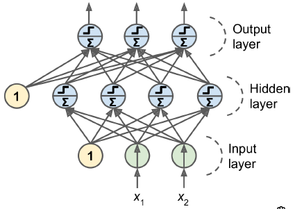
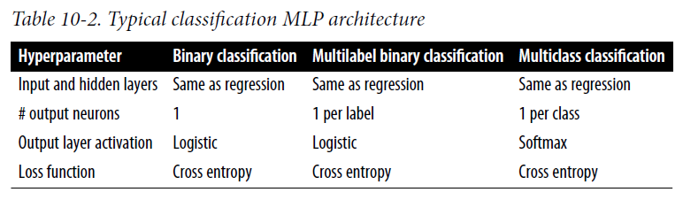

# 1. Multi Layer Perceptron

## 1.1. Perceptron

It is one of the simplest ANN architectures. 

### 1.1.1. TLU

A TLU is a threshold logical unit. Logic as below: - 

- Compute the weighted sum of its inputs i.e. $z = w_1 x_1 + w_2 x_2 + ... + w_n x_n$ or $z = W\intercal X$
- Apply a step function that outputs the result i.e. $h(x) = step(z) $
    - The most common step function is the heavy side step function. (Basically its a binary classifier and predicts `0` if $h(x) < 0$ or `1` if $h(x) >= 1$. You can also use any other threshold other than 0 if required.


### 1.1.2. Perceptron 

A perceptron is combination of multiple TLU but single layer.



You can compute the output of a fully connected layer easily.

$$ h(X) = \phi(XW + b) $$

- $\phi$ is the activation function
- $b$ is the bias
- $X$ is the input features
- $W$ is the weights

Perceptron will update its weights using the rule shown below

$$w_{new} = w_{current} + \alpha(y_j - \hat{y}_j)x $$

Because the decision boundary of each output neuron is linear, so perceptrons cannot learn complex patterns.

__Remember (Note)__

Remember that a linear model is one which has it weights as linear, even though the input parameter could be polynomial. Example below : - 

$$y = w_0 + w_1 x_1 + w_2 x_2 + w_3 x_1^2$$

The model is considered to be non linear when the weights are non linear as shown below: - 

$$y = w_0 + w_1 x_1 + w_2 x_2 + w_1 w_2 x_3$$

__Code Sample__

`sklearn` provides a Perceptron class that implements a single-TLU network.

```python
from sklearn.linear_model import Perceptron
```

Scikit-Learn’s Perceptron class is equivalent to using an SGDClassifier with the following hyperparameters: `loss="perceptron", learning_rate="constant", eta0=1` (the learning rate), and `penalty=None` i.e. no regularization.

## 1.2. Multilayer Perceptron



The MLP is composed of an input layer, one or more layers of TLU (hidden layers), and final output layer of TLU. When we have many many hidden layers it is considered a deep neural network.

### 1.2.1. BackPropogation

__Autodiff__ : A lot of frameworks provide the functionality of autodiff which computes the gradient automatically.

__Back propogation algorithm summary__ : the backpropagation algorithm first makes a prediction (forward pass) and measures the error, then goes through each layer in reverse to measure the error contribution from each connection (reverse pass), and finally tweaks the connection weights to reduce the error (Gradient Descent step).

__Random Initialization__ : It is important to initialize all the layer weights randomly.

### 1.2.2. Step Functions

Choice of step functions include the following : - 

- Sigmoid
- Hyperbolic tangent
- ReLU

### 1.2.3. Cost functions

Choice of cost functions 

- Mean Squared Error
- Mean absolute error (if you have lots of outliers)
- Huber loss (combination of the above 2)

### 1.2.4. MLP for regression

MLP can be used for regression, in this case do not apply the activation function to the output layer. The MLP can provide single value as well as multiple values (e.g. coordinate values for x, y and z). If the MLP has to provide multiple values as outputs it needs multiple output neurons.

```python
model = keras.models.Sequential([
    keras.layers.Dense(30, activation="relu", input_shape=x_train.shape[1:]),
    keras.layers.Dense(1)  # No activation function on last layer for regression.
])
model.compile(loss="mean_squared_error", optimizer="sgd")

model.fit(x_train, y_train, epochs=20, validation_data = (x_valid, y_valid))
```

### 1.2.5. MLP for classification

MLP can also be used for classification, for binary output you need just a single neuron using logistic activation function. For multilabel classification you would need more than 1 neuron.

If the classification has to be 1 of many (i.e. multiclass classification), then you can add softmax function which will ensure all the probability are between 0 and 1 and add upto 1.




```python
model = keras.models.Sequential()
model.add(keras.layers.Flatten(input_shape = [28,28]))
model.add(keras.layers.Dense(300, activation = 'relu'))
model.add(keras.layers.Dense(100, activation="relu"))
model.add(keras.layers.Dense(10, activation="softmax"))

model.compile(loss="sparse_categorical_crossentropy", optimizer = "sgd", metrics=["accuracy"])

model.fit(x_train, y_train, epochs=30, validation_data=(x_valid, y_valid))
```

You can check or enquire about the model as below: - 

```python
General info about the model
model.summary()

# Will return the layers of the model
model.layers

# Get the weights for hidden layer 1
hidden1.get_weights()

# Evaluating the model
model.evaluate(x_test, y_test)
```